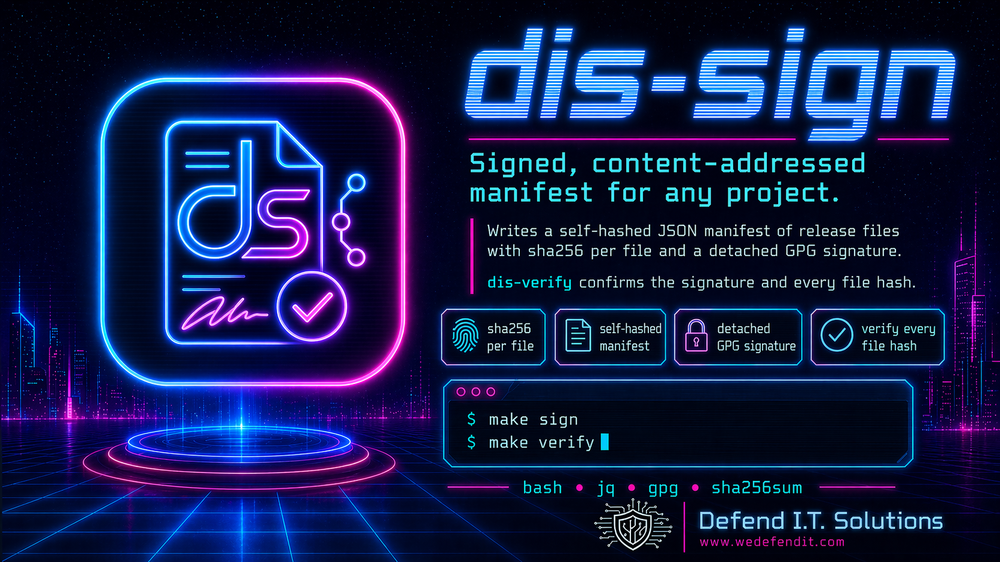
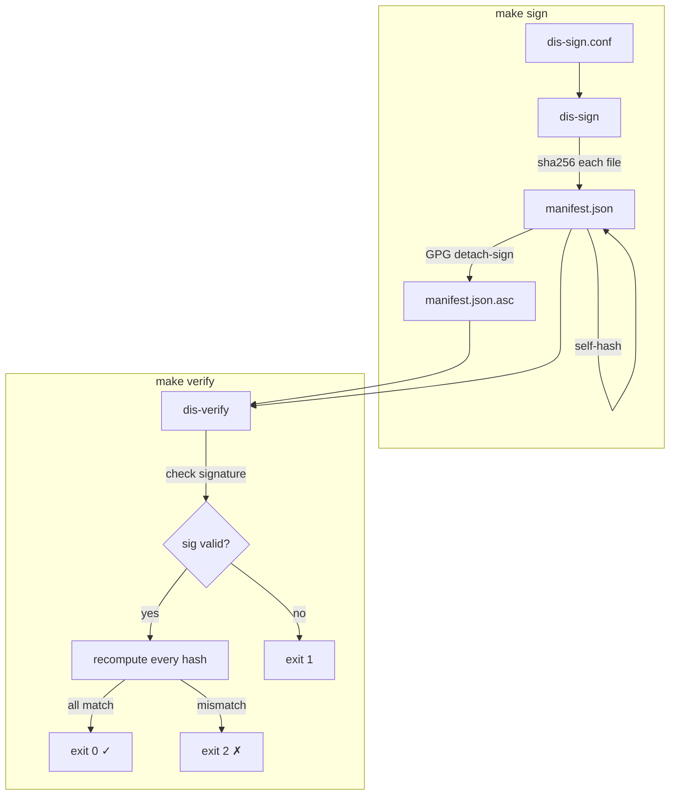

# dis-sign

Signed, content-addressed manifest for any project.



> [!IMPORTANT]  
> `dis-sign` writes a JSON manifest of your release files (sha256 per file,
> self-hashed) and a detached GPG signature.  
> `dis-verify` confirms both.

## Contents

- [dis-sign](#dis-sign)
  - [Contents](#contents)
  - [How it works](#how-it-works)
  - [Verify before you trust](#verify-before-you-trust)
  - [Add to your project](#add-to-your-project)
  - [Daily use](#daily-use)
  - [Update dis-sign later](#update-dis-sign-later)
  - [Dependencies](#dependencies)
  - [License](#license)

## How it works



## Verify before you trust

Before using dis-sign, verify its integrity. The signing key is
published on the public OpenPGP keyserver.

```sh
# 1. Fetch the public key
gpg --keyserver keys.openpgp.org \
    --recv-keys 2C4259D83B8EC4BBBA6CDCF067528B17E4558404

# 2. Verify the manifest signature (using gpg, not our code)
gpg --verify signing/dis-sign-manifest.json.asc \
    signing/dis-sign-manifest.json

# 3. Spot-check file hashes against the signed manifest
sha256sum bin/dis-sign bin/dis-verify
cat signing/dis-sign-manifest.json | jq '.artifacts.bin'
```

If the signature is valid and the hashes match, the code is safe to use.

## Add to your project

From your project root, one time:

```sh
git subtree add --prefix vendor/dis-sign \
  https://github.com/wedefendit/dis-sign main --squash

cp vendor/dis-sign/examples/dis-sign.conf .
cat vendor/dis-sign/examples/Makefile.snippet >> Makefile
```

Edit `dis-sign.conf` to set your app name and GPG key fingerprint.
The config is parsed as a constrained file, not sourced as shell.
By default every file tracked by git is included in the manifest.
To group files into named categories, define `CATEGORIES` in the config.
To exclude files (test fixtures, vendored subtrees, generated output),
define `IGNORE` as a list of bash globs. See the comments in the
example config for details.

## Daily use

```sh
make sign      # writes signing/<app>-manifest.json + .asc
make verify    # checks signature and every file hash
```

Commit `signing/` and your public key.

For a pinned trust root, pass the expected signer fingerprint:

```sh
vendor/dis-sign/bin/dis-verify \
  --trusted-fingerprint 2C4259D83B8EC4BBBA6CDCF067528B17E4558404
```

By default, `dis-verify` can auto-import a public key from `signing/`
and confirms the signature was made by the fingerprint declared in the
manifest. Use `--trusted-fingerprint` or
`DIS_VERIFY_TRUSTED_FINGERPRINT` when the verifier must reject a
manifest/key/signature bundle signed by any other key.

## Update dis-sign later

```sh
make dis-sign-update
```

## Dependencies

`bash`, `jq`, `gpg`, `sha256sum`. Standard on any Linux/macOS dev box.

If your signing key isn't in the default `~/.gnupg`, set
`DIS_SIGN_GPG_HOME`:

```sh
export DIS_SIGN_GPG_HOME=~/.gnupg-yourkey
```

## License

Apache-2.0. See [LICENSE](LICENSE).
